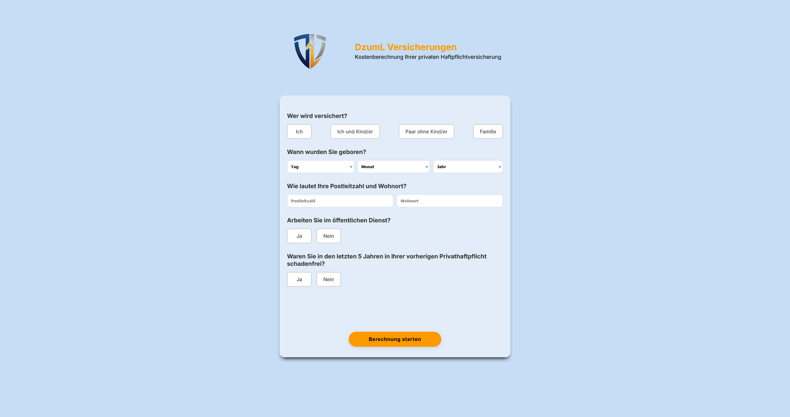
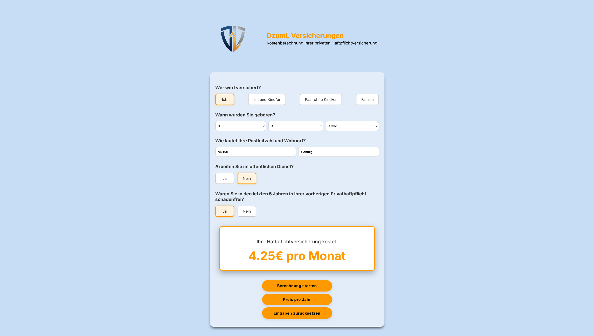

# 🧮 Mein Haftpflichtversicherungsrechner

## 📋 Kurze Beschreibung
Das ist ein kleines Webprojekt, bei dem ich einen Rechner für eine beispielhafte Haftpflichtversicherung gebaut habe. Man kann hier sein Alter, die Postleitzahl, ob man einen Beruf hat und ob man schon mal einen Schaden gemeldet hat, eingeben. Dann zeigt der Rechner einen geschätzten Jahres- und Monatsbeitrag an. Mit diesem Projekt wollte ich zeigen, wie man eine dynamische Webseite mit HTML, CSS und JavaScript umsetzt.

## ✨ Was der Rechner kann (Hauptfunktionen)
* **Rechnet sofort nach Eingabe:** Sobald man etwas eingibt, passt sich der Versicherungsbeitrag direkt an.
* **Prüft wichtige Infos:** Der Rechner achtet darauf, dass man mindestens 18 Jahre alt ist und die Postleitzahl nur aus Zahlen besteht.
* **Speichert alles im Browser:** Wenn man die Seite schließt und wieder öffnet, sind die letzten Eingaben noch da, weil sie im Browser gespeichert werden (`localStorage`).
* **Zeigt Ergebnisse klar an:** Der Jahres- und Monatsbeitrag wird deutlich und aufgeräumt dargestellt.
* **Funktioniert auf jedem Gerät:** Egal ob am PC, Tablet oder Handy, das Design passt sich immer richtig an.
* **Einfach zu bedienen:** Die Felder sind klar, und es gibt einen Knopf, um alles zurückzusetzen.

## 🛠️ Technologien
* **HTML5** – Struktur der Webseite
* **CSS3** – Styling & responsive Design (mit CSS-Variablen)
* **JavaScript (ES6+)** – Berechnungslogik, Validierung, LocalStorage

**🎓 Ein Wort zum Lernweg:**
Ich bin ein **angehender Auszubildender** und habe mir die Grundlagen der Webentwicklung in meiner Freizeit selbst beigebracht. Bei diesem Projekt hat mich eine Künstliche Intelligenz als eine Art interaktiver Lehrer und Helfer unterstützt. Sie hat mir geholfen, Dinge zu verstehen, Verbesserungsvorschläge zu machen und den Code sauber zu halten. Mein Grundwissen in Webentwicklung habe ich mir zusätzlich mit Apps wie **Mimo** angeeignet. So konnte ich viel lernen und ein Projekt bauen, das gut funktioniert, während ich gleichzeitig gelernt habe, wie man moderne Hilfsmittel richtig nutzt. Aber alle Entscheidungen und das, was im Code passiert, habe ich selbst verstanden und entschieden.

## 🌐 Wie Sie den Rechner ausprobieren können

### Live-Demo
👉 [Hier im Browser testen](https://dzuml-code.github.io/haftpflicht-rechner/)

### Code ansehen
👉 [GitHub-Repository] (https://github.com/DzumL-code/haftpflicht-rechner)

 
## 💡 Ideen für weitere Entwicklungen
Ich habe schon ein paar Ideen, wie man den Rechner noch besser machen könnte:

* **Mehr Optionen für die Berechnung:** Zum Beispiel könnte man weitere Details zur Wohnsituation (Miete/Eigentum) oder zu besonderen Dingen (wie Haustiere) abfragen, um die Berechnung genauer zu machen.
* **Schöneres Design:** Das Aussehen und die Bedienung könnten noch feiner abgestimmt werden, damit es sich noch besser anfühlt.
* **Echte Daten einbinden:** Später wäre es spannend, echte Versicherungsdaten über eine Schnittstelle anzubinden, damit die Prämien ganz realitätsnah sind.
* **Automatische Tests:** Ich könnte kleine Programme schreiben, die automatisch prüfen, ob alles richtig funktioniert, auch wenn ich am Code etwas ändere.
* **Für jeden gut nutzbar:** Ich möchte, dass der Rechner auch für Leute mit Einschränkungen gut bedienbar ist. Das nennt man Barrierefreiheit, und die könnte man noch weiter verbessern.

## 📸 Screenshots

### Desktop Ansicht 

### Desktop Ansicht mit einem jährlichen Ergebnis

### Desktop Ansicht mit einem monatlichen Ergebnis

### Desktop Ansicht bei der die Eingabe vom Geburtsdatum vergessen wurde

### Mobile Ansicht
